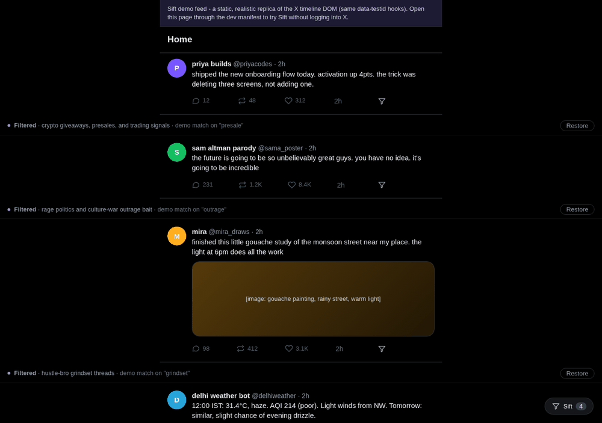
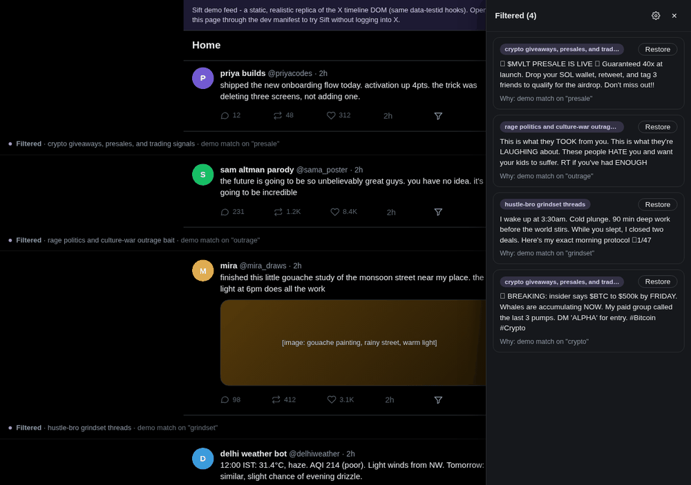

# Sift

**Filter your X/Twitter feed with words, not mutes.** Describe what you don't want to see - "crypto giveaways", "rage politics", "hustle-bro threads" - and Sift classifies your timeline as you scroll, hiding matches with a reason you can inspect. Every hidden post can be brought back in one tap.

Open source (MIT), local-first: your filters, API key, and classification cache live in the extension's own storage. The only network traffic is the classification call to the provider you configured.



## What it does

- **Natural-language filters.** Write topics, tones, or post types in plain words. No regex, no blocklists.
- **As-you-scroll classification.** A MutationObserver picks up new posts, batches them (400 ms window, max 10 per call), and hides matches with a slim placeholder that names the matched filter and the model's reason.
- **"Quiet this post."** Every post gets a small funnel button. Pick a quick reason - fewer posts like this, hide this topic, hide this author, ads/promos, rage-bait tone - and the filter extends itself, then the feed re-sifts.
- **View filtered.** The floating pill opens a drawer listing every hidden post with the model's justification and a per-post Restore button. Restores are remembered.
- **Caching.** Decisions are hashed by post text + filter set and cached locally (600-entry LRU), so re-scrolling costs nothing and filter edits invalidate automatically.



## Providers

| Provider | What leaves your machine | Needs |
|---|---|---|
| **Google Gemini** (default pick) | Post text + your filters, sent to Google's API under your key | Free key from [aistudio.google.com](https://aistudio.google.com) |
| **OpenAI-compatible** | Same, to any `/chat/completions` endpoint: OpenAI, OpenRouter, Groq, a local server | Key + base URL |
| **On-device** (experimental) | Nothing - Chrome's built-in Gemini Nano (`LanguageModel` API) does the work in the page | Recent Chrome with built-in AI available; falls back with a clear error if not |
| **Demo mode** | Nothing. Offline keyword matching | Ships as the default so you can try the UX immediately. It is not real classification - switch providers in Settings. |

Honest notes: the on-device path depends on Chrome's built-in AI rollout and is genuinely experimental. A heavier Transformers.js/WebGPU local model is a good future contribution, not shipped here. Classification reads text (and ad markers); it does not look inside images.

## Install - desktop Chrome / Edge / Brave / Arc

1. Download `sift.zip` from the latest release (or clone this repo).
2. Unzip it somewhere permanent (the folder must stay where it is).
3. Open `chrome://extensions`, toggle **Developer mode** on (top right).
4. Click **Load unpacked** and select the unzipped `sift/` folder.
5. Go to x.com. The Sift pill appears bottom-right in Demo mode.
6. Open **Sift → Settings**, pick a provider, paste your key, hit **Test**. Add a few filters.

## Install - Android

Chrome on Android does not support extensions. Two working paths:

**Kiwi Browser (Chromium, closest match):**
1. Install Kiwi Browser from the Play Store.
2. Unzip `sift.zip` on your phone (any file manager can).
3. Kiwi menu → **Extensions** → enable **Developer mode** → **+ (from .zip/.crx/.user.js)** - or use "Load unpacked" via `chrome://extensions` and pick the folder.
4. Same setup as desktop from there.

**Firefox for Android:**
Firefox Android only runs extensions from its curated list, so Sift cannot be sideloaded there today. If you want Firefox support, the desktop version installs from `about:debugging` → **This Firefox** → **Load Temporary Add-on** → pick `manifest.json`; a persistent Android-friendly build would need Mozilla signing. Contributions welcome.

## Try it without an X login

`demo/feed.html` is a static replica of the X timeline DOM (same `data-testid` hooks). To point Sift at it:

1. Serve the repo folder: `python3 -m http.server 8377` from the repo root.
2. Temporarily add `"http://localhost:8377/*"` to `content_scripts[0].matches` and `host_permissions` in `manifest.json` (a dev-only edit - don't ship it).
3. Reload the extension, open `http://localhost:8377/demo/feed.html`, and watch Demo mode filter the fake feed.

## Architecture

```
src/
  background.js   service worker: storage schema, decision cache, provider calls, retries
  providers.js    Gemini + OpenAI-compatible + demo classifiers, shared prompt builder
  content/        timeline observer, batching, hide/restore, quick menu, pill, drawer
  popup/          on/off, quick filter editing, filtered count
  options/        providers, keys, filters, hidden authors, data controls
demo/feed.html    offline replica timeline for trying Sift
```

No build step. Plain ES2022, MV3, one runtime dependency-free codebase.

## Privacy

- Keys and filters: `chrome.storage.local` only.
- Cache: hashes + decisions, local, clearable from Settings.
- No analytics, no telemetry, no home server. Uninstalling (or "Erase everything" in Settings) removes all traces.

## License

MIT. Sift is original work inspired by the idea of AI feed filtering; it shares no code with any other project.
